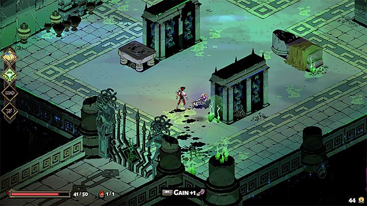
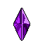
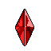
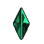
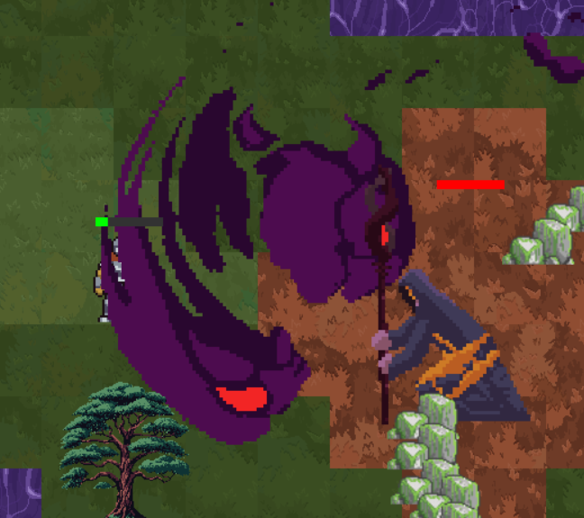
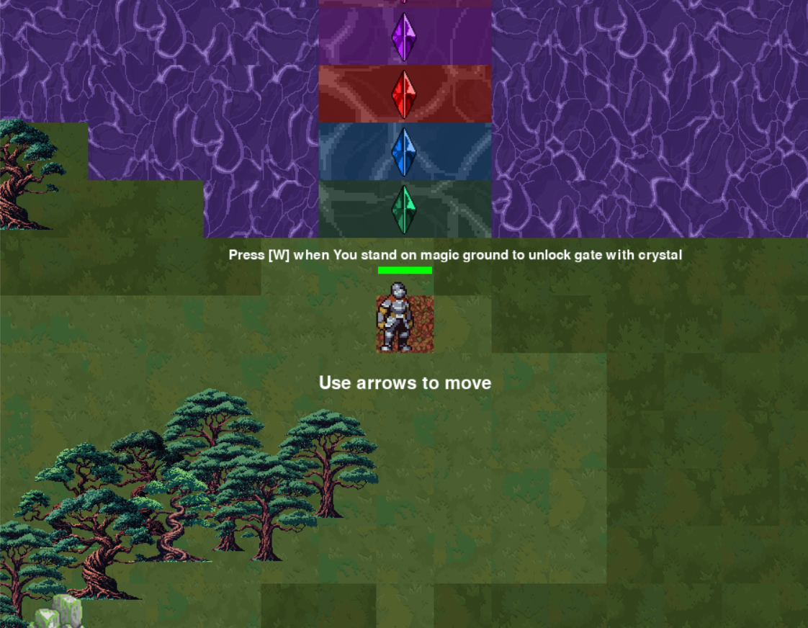

# Crystalia - Game Design Document - EN

The repository contains an implementation of the game *Crystalia* developed in Pygame. In it, a brave knight ought to find five magic crystals that will open the way forward, but to do so he has to fight furious monsters and use his search skills

**Author:** Tymofii Sukhariev 

**Chosen theme:** Color as a gameplay feature

---

## 1. Introduction
*Crystalia* is an adventure-themed game designed for the Object Technologies course. The goal is to develop a working prototype where the player must find exit from game by defeating enemies and collect crystals to advance. The game immerses the player in a fantasy world where strategic movement and item collection are essential for survival.

### 1.1 Inspiration
**Hades**  
*Hades* is a rogue-like dungeon crawler with fast-paced combat and various items to enhance the player's abilities. This inspired *Crystalia*'s design, incorporating survival and collection mechanics.

|    |
|:--------------------------------:|
| ***Figure 1 Preview of Hades***  |

---

## 1.2 Player Experience
The player's objective is to survive increasingly difficult combats with enemies while collecting crystals scattered throughout the level. The player must use potions to sustain health and overcome obstacles. The experience revolves around movement, survival, and searching skills.

---

## 1.3 Development Software
- **Pygame-CE** – Chosen framework for development.
- **PyCharm 2024.1** – Primary IDE.
- **Tiled 1.10.2** – Used for designing levels.
- **Itch.io** – Source for game assets and sound effects.

---

## 2. Concept

### 2.1 Gameplay Overview
The player moves around a two-dimensional map filled with enemies and obstacles. The goal is to collect all the crystals and open 5 gates corresponding to the color so that the Hero can exit the level.

### 2.2 Theme Interpretation (Color as a gameplay feature)
The game is dedicated to finding all five colorful crystals, which are the key to the gate. In search of them you will have to fight with enemies and explore the whole level.

|  |
|:---------------------------------------------------------------------------------------------------------------------------------------------------------------------------------------------------:|
|                                                                                       ***Figure 2 Crystals***                                                                                       |

### 2.3 Primary Mechanics
- **Obstacles:** Objects on the map block player movement.
- **Bonus Items:** Potions and crystals can be collected to boost health and abilities.
- **Enemy Spawning:** Enemies spawn from fixed points, preventing unfair placement near the player also they are obstacle for the player in the same time to collect crystals.
- **Combat:** Players attack with sword, damaging enemies on impact.

---

## 2.4 Class Design
- **Game:** Manages the game loop, start screen, and overall progression.
- **Player:** Represents the player's movement, actions, and attributes.
- **Enemy:** Contains enemy behavior, pathfinding, and interactions with the player.
- **Item:** Manages potions and crystals, handling interactions and sound effects.
- **BridgeItem:** Represents a gate that blocks the player's path to the endpoint

---

## 3. Art

### 3.1 Theme Interpretation
The game features a medieval fantasy aesthetic with vibrant 2D sprite-based characters and environments. Enemy designs include monsters and knights, emphasizing the fantasy theme.

|  |
|:-----------------------------------:|
| ***Figure 3 Combat with Warlock***  |

### 3.2 Design
The visual elements are sourced from [Itsch.io](https://itch.io/game-assets), ensuring consistency in medieval fantasy art. Levels incorporate different environments, combining stone, grass, and dungeon aesthetics.

|  |
|:------------------------------------:|
|        Figure 3 Level Design         |
---

## 4. Audio

### 4.1 Music
Background music is sourced from *Fantasy RPG Music Pack* (https://alkakrab.itch.io/free-25-fantasy-rpg-game-tracks-no-copyright-vol-2), complementing the fantasy theme with atmospheric tracks.

### 4.2 Sound Effects
Sound effects (fireball shots, item collection) come from *RPG Essentials SFX* (https://leohpaz.itch.io/rpg-essentials-sfx-free?download), enhancing the immersive experience.

---

## 5. Game Experience

### 5.1 UI
The user interface aligns with the medieval fantasy theme, providing options for starting the game, restarting and exiting.

### 5.2 Controls
**Keyboard**
- **Q and E:** Attack left and right
- **W:** Place crystal 
- **Arrow Keys:** Move the player.
